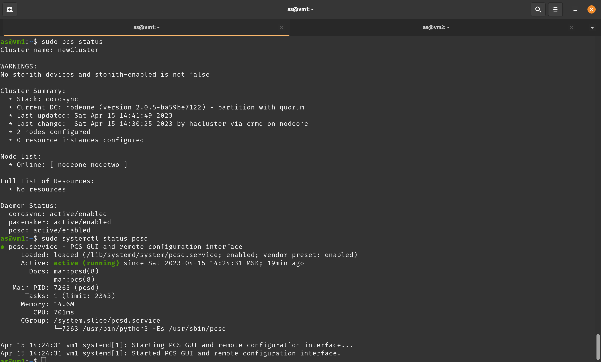

# Домашнее задание к занятию "10.3 «Pacemaker»" - `Андрей Сотников`

---

### Задание 1

> Опишите основные функции и назначение Pacemaker.

Pacemaker - менеджер ресурсов кластера, который предназначен для достижения максимальной доступности ресурсов: обнаружения сбоев и восстановления работоспособности на уровне узлов и сервисов.  

Основные возможности Pacemaker:

* Не зависит от подсистемы хранения;
* Не зависит от типов ресурсов;
* Поддерживает кластеры (и кворумные, и ресурсозависимые) любого размера;
* Поддерживает практически любую избыточную конфигурацию;
* Поддерживает STONITH (Shoot-The-Other-Node-In-The-Head);
* Авторепликация конфигурации на все узлы кластера;
* Возможность задать порядок запуска и остановки приложений, а так же их совместимости на одном узле.
* Поддерживает расширенные типы ресурсов, такие как клоны и дополнительные состояния

---

### Задание 2

> Опишите основные функции и назначение Corosync.

Corosync отслеживает и передает состояние всех нод в кластере, а так же позволяет:

* Отслеживать статус приложений;
* Оповещать приложения о смены активной ноды в кластере;
* Отправлять идентичные сообщения процессам на всех нодах;
* Предоставлять доступ к общей БД с конфигурацией и статистикой и отправлять уведомления об изменениях в БД.

---

### Задание 3

> Соберите модель, состоящую из двух виртуальных машин.
> Установите Pacemaker, Corosync, Pcs. Настройте HA кластер.
> Пришлите скриншот рабочей конфигурации и состояния сервиса для каждого нода.

nodeone:  

nodetwo:  
